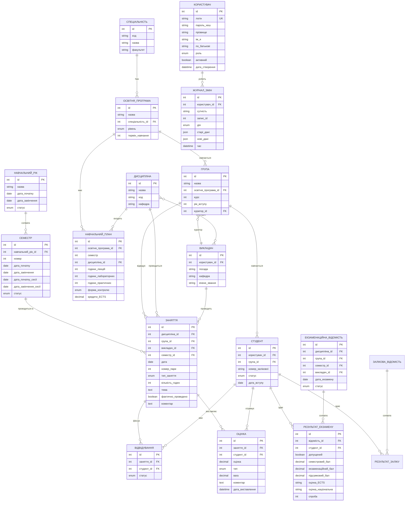

# Технічне завдання: Електронний журнал успішності коледжу

## 1. ЗАГАЛЬНІ ПОЛОЖЕННЯ

### 1.1. Найменування системи
**"Електронний журнал успішності"** (ЕЖУ)

### 1.2. Мета створення
Автоматизація обліку успішності та відвідуваності студентів коледжу, формування звітності та забезпечення доступу до інформації для всіх учасників навчального процесу.

### 1.3. Цільова аудиторія
- Студенти (перегляд власних оцінок і відвідування)
- Викладачі (ведення журналів, виставлення оцінок)
- Куратори (моніторинг груп)
- Менеджери/Дирекція (аналітика, звітність)
- Адміністратори (управління системою)

---

## 2. ФУНКЦІОНАЛЬНІ ВИМОГИ

### 2.1. Основні сутності системи

#### 2.1.1. Організаційна структура
```
НАВЧАЛЬНИЙ_РІК
├── назва (наприклад, "2024-2025")
├── дата_початку
├── дата_закінчення
├── статус (активний/архівний)
└── СЕМЕСТРИ[]
    ├── номер (1 або 2)
    └── статус (активний/архівний)

СПЕЦІАЛЬНІСТЬ
├── код (наприклад, "076")
├── назва ("Підприємництво, торгівля та біржова діяльність")

ОСВІТНЯ_ПРОГРАМА
├── назва
├── спеціальність_id
└── термін_навчання

ГРУПА
├── назва (наприклад, "ПТ-41")
├── освітня_програма_id
├── курс (1, 2, 3, 4)
├── рік_вступу
└── куратор_id

ДИСЦИПЛІНА
├── назва
├── освітня програма
```

#### 2.1.2. Навчальний процес
```
НАВЧАЛЬНИЙ_ПЛАН
├── освітня_програма_id
├── семестр (1-8)
├── дисципліна_id
├── години_лекцій
├── години_лабораторних
├── години_практичних
├── години_консультацій
├── форма_контролю (екзамен/залік/диф.залік)
└── кредити_ECTS

РОЗКЛАД
├── група_id
├── дисципліна_id
├── викладач_id
├── день_тижня
├── номер_пари
├── тип_заняття
├── аудиторія
└── період_дії (дата_від, дата_до)

ЗАНЯТТЯ
├── дисципліна_id
├── група_id
├── викладач_id
├── дата
├── номер_пари
├── тип_заняття (лекція/лабораторна/практична/консультація)
├── кількість_годин (default: 2)
├── тема
└── коментар

ВІДВІДУВАННЯ
├── заняття_id
├── студент_id
└── статус (пусто, нб, інд)

ОЦІНКА
├── заняття_id
├── студент_id
├── оцінка (десяткове число)
├── коментар
```

#### 2.1.3. Атестація
```
ВІДОМІСТЬ
├── дисципліна_id
├── група_id
├── семестр_id
├── викладач_id
├── дата_екзамену
├── форма_контролю (екзамен/диф.залік)
├── спроба (1/2/комісія)
└── РЕЗУЛЬТАТИ[]
    ├── студент_id
    ├── оцінка_десяткова (або н.з., н.д., зараховано, не зараховано)
    ├── оцінка_словами (відмінно, добре, задовільно, незадовільно)

```

#### 2.1.4. Користувачі
```
КОРИСТУВАЧ
├── логін (унікальний)
├── пароль_хеш
├── прізвище
├── ім'я
├── по_батькові
├── роль (студент/викладач/куратор/менеджер/адміністратор)

СТУДЕНТ (extends КОРИСТУВАЧ)
├── група_id
├── номер_залікової_книжки
├── статус (навчається/академічна_відпустка/відрахований)
└── дата_вступу

ВИКЛАДАЧ (extends КОРИСТУВАЧ)
├── посада
├── категорія
├── пед_звання
├── вчене_звання
└── науковий_ступінь

ВИКЛАДАЧ_ДИСЦИПЛІНА (зв'язок багато-до-багатьох)
├── викладач_id
├── дисципліна_id
├── група_id
└── семестр_id

МЕНЕДЖЕР_СПЕЦІАЛЬНІСТЬ (зв'язок багато-до-багатьох)
├── менеджер_id
└── спеціальність_id
```


## 3. СХЕМА БАЗИ ДАНИХ



---

## 4. АРХІТЕКТУРА СИСТЕМИ

### 4.1. Технологічний стек

**Backend:**
- Python 3.11+
- FastAPI (веб-фреймворк)
- SQLAlchemy 2.0 (ORM)
- Alembic (міграції БД)
- Pydantic (валідація даних)
- python-jose (JWT токени)
- passlib (хешування паролів)
- openpyxl / xlsxwriter (експорт Excel)
- reportlab (генерація PDF)

**База даних:**
- PostgreSQL 15+ або MySQL

**Frontend:**
- Jinja2 (шаблони)
- Bootstrap 5 (UI framework) або Tailwind
- DataTables.js (таблиці з сортуванням)
- Chart.js (графіки аналітики)

**Додатково:**
- Redis (кешування, черги)
- Celery (асинхронні задачі)
- Nginx (reverse proxy)

### 4.2. Структура проекту

```
ejournal/
├── alembic/                    # Міграції БД
│   ├── versions/
│   └── env.py
├── app/
│   ├── __init__.py
│   ├── main.py                 # Точка входу FastAPI
│   ├── config.py               # Конфігурація
│   ├── database.py             # Підключення до БД
│   │
│   ├── models/                 # SQLAlchemy моделі
│   │   ├── __init__.py
│   │   ├── user.py
│   │   ├── academic.py         # Навчальний рік, семестр
│   │   ├── structure.py        # Спеціальність, програма, група
│   │   ├── discipline.py
│   │   ├── lesson.py
│   │   ├── grade.py
│   │   ├── statement.py        # Відомості
│   │
│   ├── schemas/                # Pydantic схеми
│   │   ├── __init__.py
│   │   ├── user.py
│   │   ├── academic.py
│   │   ├── lesson.py
│   │   └── ...
│   │
│   ├── api/                    # API endpoints
│   │   ├── __init__.py
│   │   ├── deps.py             # Залежності (авторизація)
│   │   ├── auth.py             # Аутентифікація
│   │   ├── users.py
│   │   ├── students.py
│   │   ├── teachers.py
│   │   ├── groups.py
│   │   ├── disciplines.py
│   │   ├── lessons.py
│   │   ├── grades.py
│   │   ├── statements.py
│   │   ├── reports.py
│   │   └── admin.py
│   │
│   ├── crud/                   # CRUD операції
│   │   ├── __init__.py
│   │   ├── base.py
│   │   ├── user.py
│   │   ├── student.py
│   │   └── ...
│   │
│   ├── services/               # Бізнес-логіка
│   │   ├── __init__.py
│   │   ├── auth.py
│   │   ├── grade_calculator.py
│   │   ├── export_service.py
│   │   ├── report_service.py
│   │   └── notification_service.py
│   │
│   ├── templates/              # Jinja2 шаблони
│   │   ├── base.html
│   │   ├── auth/
│   │   │   ├── login.html
│   │   │   └── logout.html
│   │   ├── student/
│   │   │   ├── dashboard.html
│   │   │   └── grades.html
│   │   ├── teacher/
│   │   │   ├── dashboard.html
│   │   │   ├── journal.html
│   │   │   └── statement.html
│   │   ├── curator/
│   │   ├── manager/
│   │   ├── admin/
│   │   └── components/
│   │       ├── navbar.html
│   │       └── sidebar.html
│   │
│   ├── static/                 # Статичні файли
│   │   ├── css/
│   │   ├── js/
│   │   └── img/
│   │
│   └── utils/                  # Допоміжні функції
│       ├── __init__.py
│       ├── security.py
│       ├── validators.py
│       └── constants.py
│
├── tests/                      # Тести
│   ├── __init__.py
│   ├── conftest.py
│   ├── test_auth.py
│   ├── test_grades.py
│   └── ...
│
├── migrations/                 # Скрипти міграцій
├── docs/                       # Документація
├── docker-compose.yml
├── Dockerfile
├── requirements.txt
├── .env.example
└── README.md
```

### 4.3. API Endpoints

#### Аутентифікація
```
POST   /api/auth/login          # Вхід
POST   /api/auth/logout         # Вихід
POST   /api/auth/refresh        # Оновлення токену
GET    /api/auth/me             # Поточний користувач
```

#### Користувачі (Адміністратор)
```
GET    /api/users               # Список користувачів
POST   /api/users               # Створити користувача
GET    /api/users/{id}          # Деталі користувача
PUT    /api/users/{id}          # Оновити користувача
DELETE /api/users/{id}          # Видалити користувача
POST   /api/users/import        # Імпорт користувачів (Excel/CSV)
```

#### Студенти
```
GET    /api/students            # Список студентів
POST   /api/students            # Створити студента
GET    /api/students/{id}       # Деталі студента
PUT    /api/students/{id}       # Оновити студента
GET    /api/students/{id}/grades           # Оцінки студента
GET    /api/students/{id}/attendance       # Відвідування студента
POST   /api/students/import-group          # Імпорт групи студентів
```

#### Викладачі
```
GET    /api/teachers            # Список викладачів
POST   /api/teachers            # Створити викладача
GET    /api/teachers/{id}       # Деталі викладача
GET    /api/teachers/{id}/disciplines      # Дисципліни викладача
GET    /api/teachers/{id}/load             # Навантаження викладача
```

#### Групи
```
GET    /api/groups              # Список груп
POST   /api/groups              # Створити групу
GET    /api/groups/{id}         # Деталі групи
PUT    /api/groups/{id}         # Оновити групу
GET    /api/groups/{id}/students           # Студенти групи
GET    /api/groups/{id}/schedule           # Розклад групи
```

#### Дисципліни
```
GET    /api/disciplines         # Список дисциплін
POST   /api/disciplines         # Створити дисципліну
GET    /api/disciplines/{id}    # Деталі дисципліни
PUT    /api/disciplines/{id}    # Оновити дисципліну
```

#### Заняття
```
GET    /api/lessons             # Список занять (з фільтрами)
POST   /api/lessons             # Створити заняття
GET    /api/lessons/{id}        # Деталі заняття
PUT    /api/lessons/{id}        # Оновити заняття
DELETE /api/lessons/{id}        # Видалити заняття
POST   /api/lessons/{id}/attendance        # Проставити відвідування
POST   /api/lessons/{id}/grades            # Проставити оцінки
POST   /api/lessons/bulk-attendance        # Масове відвідування
```

#### Оцінки
```
GET    /api/grades              # Список оцінок (з фільтрами)
POST   /api/grades              # Виставити оцінку
PUT    /api/grades/{id}         # Оновити оцінку
DELETE /api/grades/{id}         # Видалити оцінку
GET    /api/grades/student/{student_id}/discipline/{discipline_id}  # Оцінки студента з дисципліни
```

#### Відомості
```
GET    /api/statements/exam     # Екзаменаційні відомості
POST   /api/statements/exam     # Створити екз. відомість
GET    /api/statements/exam/{id}            # Деталі відомості
PUT    /api/statements/exam/{id}            # Оновити відомість
POST   /api/statements/exam/{id}/close      # Закрити відомість
GET    /api/statements/exam/{id}/print      # Друк відомості (PDF)

GET    /api/statements/credit   # Залікові відомості
POST   /api/statements/credit   # Створити залікову відомість
# ... аналогічно екзаменаційним
```

#### Звіти та Експорт
```
GET    /api/reports/group/{id}/performance      # Успішність групи
GET    /api/reports/teacher/{id}/load           # Навантаження викладача
GET    /api/reports/discipline/{id}/statistics  # Статистика по дисципліні
GET    /api/reports/debtors                     # Список боржників

POST   /api/export/grades       # Експорт оцінок (Excel)
POST   /api/export/attendance   # Експорт відвідування (Excel)
POST   /api/export/statements   # Експорт відомостей (Excel)
```

#### Адміністрування
```
GET    /api/admin/academic-years            # Навчальні роки
POST   /api/admin/academic-years            # Створити навчальний рік
POST   /api/admin/academic-years/{id}/archive  # Архівувати рік

GET    /api/admin/semesters     # Семестри
POST   /api/admin/semesters     # Створити семестр

GET    /api/admin/audit-log     # Журнал змін
GET    /api/admin/statistics    # Загальна статистика системи
POST   /api/admin/backup        # Створити резервну копію
```

---

## 5. ФУНКЦІОНАЛЬНІ МОДУЛІ

### 5.1. Модуль "Студент"

**Головна сторінка:**
- Список дисциплін поточного семестру
- Кількість пропусків
- Календар занять на тиждень (колись)

**Сторінка дисципліни:**
- Таблиця занять (дата, тема, відвідування, оцінка)

**Відомості:**
- Перегляд екзаменаційних/залікових відомостей
- Історія здачі (спроби)

### 5.2. Модуль "Викладач"

**Головна сторінка:**
- Список дисциплін та груп

**Журнал занять:**
- Вибір групи та дисципліни
- Створення/редагування заняття:
  - Дата, пара, тип, тема
  - Кількість годин
- Таблиця студентів:
  - ПІБ
  - Відвідування (✓/✗) - можливість масового проставлення
  - Коментар
- Збереження журналу
- Експорт журналу в Excel


**Відомості:**
- Створення відомості
- Проставлення оцінок
- Закриття відомості
- Друк відомості (PDF)

**Звіти:**
- Виконання навантаження (години за місяць/семестр)
- Статистика успішності по групах

### 5.3. Модуль "Куратор"

**Головна сторінка:**
- Інформація про групу
- Список студентів
- Загальна успішність
- Загальна відвідуваність

**Моніторинг успішності:**
- Таблиця студентів з середнім балом по кожній дисципліні
- Сортування, фільтрація
- Виділення боржників (червоним)
- Рейтинг студентів

**Моніторинг відвідуваності:**
- Таблиця студентів з відсотком відвідуваності
- Деталі пропусків (дата, дисципліна, причина)
- Фільтр по періоду

**Звіти:**
- Зведений звіт по групі (Excel/PDF)
- Список боржників

### 5.4. Модуль "Менеджер / Дирекція"


**Аналітика успішності:**
- Зведена таблиця по групах
- Розподіл студентів по рівням успішності

**Аналітика відвідуваності:**
- Відсоток відвідуваності по групах
- Динаміка по місяцях


**Звіти:**
- Експорт даних в Excel

### 5.5. Модуль "Адміністратор"

**Управління користувачами:**
- CRUD користувачів
- Зміна ролей
- Скидання паролів
- Імпорт користувачів (Excel/CSV)

**Управління структурою:**
- Навчальні роки, семестри
- Спеціальності, освітні програми
- Групи, дисципліни
- Навчальні плани

**Управління розкладом:**
- Завантаження розкладу (Excel)
- Редагування розкладу
- Копіювання розкладу

**Налаштування системи:**
- Шкали оцінювання
- Формули розрахунку балів
- Правила допуску до екзамену
- Email-шаблони

**Архівація:**
- Архівація навчальних років
- Архівація семестрів
- Створення резервних копій БД

**Журнал змін:**
- Перегляд історії всіх змін
- Фільтр по користувачу, даті, сутності
- Відкат змін (опціонально)

**Статистика системи:**
- Кількість користувачів по ролях
- Активність по днях/годинах
- Використання дискового простору
- Швидкість відгуку API

---

## 6. БЕЗПЕКА ТА ПРАВА ДОСТУПУ

### 6.1. Матриця прав доступу

| Дія | Студент | Викладач | Куратор | Менеджер | Адмін |
|-----|---------|----------|---------|----------|-------|
| Переглядати власні оцінки | ✅ | ✅ | ✅ | ✅ | ✅ |
| Переглядати оцінки інших студентів | ❌ | ✅* | ✅** | ✅*** | ✅ |
| Виставляти оцінки | ❌ | ✅* | ❌ | ❌ | ✅ |
| Редагувати оцінки | ❌ | ✅* | ❌ | ❌ | ✅ |
| Видаляти оцінки | ❌ | ❌ | ❌ | ❌ | ✅ |
| Створювати заняття | ❌ | ✅* | ❌ | ❌ | ✅ |
| Редагувати заняття | ❌ | ✅* | ❌ | ❌ | ✅ |
| Створювати відомості | ❌ | ✅* | ❌ | ❌ | ✅ |
| Закривати відомості | ❌ | ✅* | ❌ | ❌ | ✅ |
| Переглядати звіти по групі | ❌ | ❌ | ✅** | ✅*** | ✅ |
| Переглядати звіти по спеціальності | ❌ | ❌ | ❌ | ✅*** | ✅ |
| Управляти користувачами | ❌ | ❌ | ❌ | ❌ | ✅ |
| Управляти структурою | ❌ | ❌ | ❌ | ❌ | ✅ |
| Журнал змін | ❌ | ❌ | ❌ | ✅ | ✅ |

\* - тільки по своїх дисциплінах і групах
\** - тільки по своїй групі
\*** - тільки по своїх спеціальностях (або всі для дирекції)

### 7.2. Правила безпеки

**Паролі:**
- Мінімум 3 символи
- Зберігання в явному вигляді (!!)


**Валідація:**
- Всі вхідні дані валідуються через Pydantic
- SQL-ін'єкції неможливі (ORM)
- XSS-захист (автоматичне екранування в Jinja2)

**Логування:** в майбутньому
- Всі зміни оцінок логуються
- Всі входи в систему логуються
- IP-адреси зберігаються

---

## 7. ЕКСПОРТ ТА ЗВІТНІСТЬ

### 7.1. Формати експорту

**Excel (.xlsx):**
- Журнали занять
- Відомості
- Зведені звіти
- Списки студентів

**PDF:**
- Екзаменаційні відомості (офіційна форма)
- Залікові відомості (офіційна форма)
- Звіти для друку

**CSV:**
- Експорт даних для аналітики
- Імпорт/експорт користувачів

## 8. КРИТЕРІЇ ПРИЙМАННЯ

### 8.1. Функціональні критерії

✅ **Авторизація:**
- Вхід/вихід працює
- Ролі працюють коректно
- Сесії зберігаються

✅ **Журнали:**
- Викладач може створити заняття
- Викладач може проставити відвідування
- Викладач може виставити оцінки
- Оцінки коректно розраховуються

✅ **Відомості:**
- Можна створити відомість
- Конвертація шкал
- Друк PDF

✅ **Звіти:**
- Студент бачить свої оцінки
- Куратор бачить звіт по групі
- Менеджер бачить зведену аналітику
- Експорт в Excel працює

✅ **Адміністрування:**
- CRUD всіх сутностей
- Імпорт користувачів
- Архівація працює
